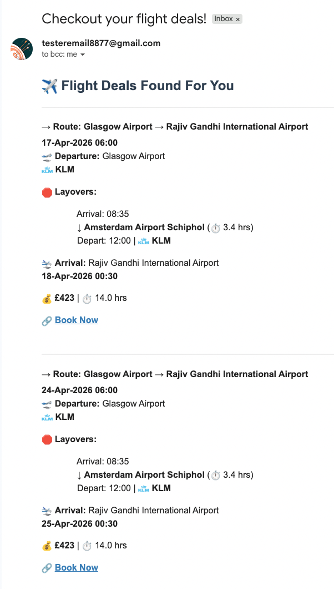

# ✈️ Flight Deal Alert System
An end to end automated flight price monitoring and alerting pipeline that functions like a lightweight data engineering system with real time API ingestion, rule based decisioning, and scheduled notifications.

The project demonstrates multi API integration, stateful data persistence, conditional alerting, and production style error handling using Python.

---

## ⚡ At a Glance

| | |
|---|---|
| 🔧 | Fetches user preferences from Google Sheets via Sheety API |
| 🌐 | Searches live flight data using SerpAPI (Google Flights) |
| 🎯 | Filters flights by price, duration, and layover count |
| 📊 | Updates the Google Sheet with the lowest discovered price |
| 📧 | Sends rich HTML email alerts with booking links |
| 🔁 | Designed to run automatically via cron or Task Scheduler |

---

## 📝 User Input Collection

Users submit their flight preferences through a Google Form, which automatically populates the Google Sheet that the system reads from.

The form captures:
- ✉️ **Email Address** – where to send the deal alerts
- 🛫 **Departure & Arrival Airport Codes** – IATA codes for the route
- 💷 **Price Target** – maximum price the user is willing to pay
- ⏱️ **Duration Target** – maximum total flight time in minutes
- 🔁 **Number of Stops** – maximum layovers allowed
- 📅 **Journey Date** – intended departure date

[📋 Fill out the form to receive flight deals](https://forms.gle/iMjpH7a8etPhJh969)

> The form responses are stored in a Google Sheet via Sheety API, which the system polls to fetch new user targets.

---

## 📌 Key Features

- 📄 **Google Sheets as a database** stores user targets (origin, destination, max price, max duration, max layovers, departure date) and tracks `lowestPriceFound`
- 🔌 **SerpAPI integration** queries Google Flights for each user on their exact departure date
- ✅ **Smart filtering** accepts a flight only if it meets all user constraints; rejects otherwise
- 💾 **Dynamic price update** when a lower price is found, updates the corresponding row in the sheet via Sheety PUT request
- 📧 **Rich email alerts** include departure/arrival times, layover details (airport, duration, airline, logo), total duration, and a shortened booking link
- 🧹 **Expired flight cleanup** detects past departure dates and deletes the corresponding row from the form responses sheet

---

## 📡 Data Pipeline Architecture

```
Google Sheets (User State Store)
        ↓
Sheety API Ingestion Layer
        ↓
SerpAPI Flight Retrieval Engine
        ↓
Rule-Based Decision Engine
        ↓
State Update Layer (Price Tracking)
        ↓
Notification Engine (HTML Email Builder)
        ↓
SMTP Delivery System
```

---

## 🗄️ Data Flow Pipeline

The system uses Google Sheets as a structured data backend, separating user input from automated processing. The filtered sheets are created once using Google Sheets functions; the Python script consumes only the final, ready‑to‑use target sheet.

```
User Input (Google Form)
        │
        ▼ (Auto-populate)
Master Responses Sheet ("Form Responses 1")
        │
        ├──► Manual Data Processing & Filtering (Google Sheets formulas)
        │      • Clean raw data (e.g., parse dates, trim emails)
        │      • Apply filters (e.g., exclude incomplete entries)
        │      • Populate processed sheets (e.g., "Form_Responses_2")
        │
        ▼
Filtered Target Sheets (e.g., "Form_Responses_2")
        │
        ├──► Further Filtering (manual, optional)
        │      • Separate active from expired requests
        │      • Categorize by destination or date
        │
        ▼
Final Target Sheet ("Sheet1")
        │
        └──► Read by Python Script (via Sheety API)
                    │
                    ▼
              Flight Search & Alerting
```

**How it works:**

1. **Form Responses** – Users submit flight preferences via a Google Form, which automatically writes to a master "Form Responses" sheet in the spreadsheet.
2. **Manual Data Processing** – Using Google Sheets functions (like `FILTER()` or `QUERY()`), the spreadsheet owner populates separate, processed sheets (e.g., "Form_Responses_2") with cleaned and validated data. This is a one‑time setup, not automated by the script.
3. **Target Preparation** – A final sheet ("Sheet1") serves as the filtered target list for the Python script. It contains only active, ready‑to‑process user records.
4. **Automated Ingestion** – The Python script, via the Sheety API, reads only the processed target sheet ("Sheet1"), not the raw responses, preventing API noise and simplifying error handling.

> **Why this matters:** This pipeline ensures the automation script works with clean, structured data, free from incomplete form entries or invalid formatting. The separation of manual filtering from automated processing is a practical, low‑code approach suitable for non‑technical collaborators.

---

## ⚙️ Tech Stack

| Tool | Purpose |
|---|---|
| Python 3.x | Core scripting language |
| Sheety API | Read and write Google Sheets as a REST API |
| SerpAPI | Google Flights search endpoint |
| `smtplib` + Gmail | Email delivery |
| `requests` | HTTP calls to Sheety and SerpAPI |
| `pyshorteners` | TinyURL link shortening |
| `dotenv` | Environment variable management |

---

## 🧩 Code Structure

The system is split into four main modules, all called from `main.py`:

```
sheets_data.py       → load_targets(): reads user preferences from Google Sheet
flight_search.py     → search_flights(): sequential SerpAPI queries, returns raw results
data_manager.py      → process_flight_deals(): filters flights, updates sheet, builds deal objects
email_manager.py     → build_emails(): constructs HTML per user, handles URL shortening
main.py              → orchestrates all steps, sends emails via SMTP
```

> Note: Some modules execute code at import time (e.g., reading the sheet). For production use, consider refactoring to lazy loading. Logging is centralised and configurable.

---

## 📊 Example Output (Email HTML)

```html
<h2>✈️ Flight Deals Found For You</h2>
<hr>
<h4>→ Route: London Heathrow (LHR) → Paris Charles de Gaulle (CDG)</h4>
<p><strong>15-May-2025 08:30</strong><br>
🛫 <strong>Departure:</strong> London Heathrow<br>
 <strong>Air France</strong></p>
<p><strong>🛑 Layovers:</strong></p>
<ul>
  <li>Arrival: 10:15<br>↓ <strong>Amsterdam Schiphol (AMS)</strong> (⏱ 1.5 hrs)<br>
  Depart: 11:45 |  <strong>KLM</strong></li>
</ul>
<p>🛬 <strong>Arrival:</strong> Paris Charles de Gaulle<br>
<strong>15-May-2025 13:30</strong></p>
<p>💰 <strong>£145</strong> | ⏱ 5.0 hrs</p>
<p>🔗 <strong><a href='https://tinyurl.com/...'>Book Now</a></strong></p>
```

## 📧 Sample Email Alert

Below is a real screenshot of the HTML email received by a user when a qualifying flight deal is found. The email includes route, departure/arrival times, layover details, airline logo, price, duration, and a shortened booking link.



---

## 🔁 Automating with GitHub Actions

The script can be scheduled to run automatically every 6 hours using GitHub Actions. This eliminates the need for a local cron job or Task Scheduler.

Create a workflow file (e.g., `.github/workflows/flight_deal_finder.yml`) with the following content:

```yaml
name: Flight Deal Alert System

env:
    SENDER_EMAIL: ${{secrets.SENDER_EMAIL}}
    SENDER_EMAIL_PASS: ${{secrets.SENDER_EMAIL_PASSWORD}}
    SERP_API_KEY: ${{secrets.SERP_API_KEY}}
    SHEETS_URL_FLIGHT_DEAL: ${{secrets.SHEETS_URL_FLIGHT_DEAL}}
    SHEETS_FLIGHT_DEAL_DELETE_URL: ${{secrets.SHEETS_FLIGHT_DEAL_DELETE_URL}}

on:
  # The Cron Schedule – runs every 6 hours
  schedule:
    - cron: "0 */6 * * *"
  # Allows you to run this workflow manually from the Actions tab
  workflow_dispatch:

jobs:
  build:
    runs-on: ubuntu-latest
    permissions:
      contents: write
    steps:
      - name: Checkout code
        uses: actions/checkout@v4
      - name: Set up Python
        uses: actions/setup-python@v5
        with:
          python-version: "3.11"
      - name: Install dependencies
        run: pip install -r requirements.txt
      - name: Run script
        run: python main.py
```

**Setup Steps:**
1. Add the workflow file to your repository (`.github/workflows/flight_deal_finder.yml`).
2. Add the required secrets (`SENDER_EMAIL`, `SENDER_EMAIL_PASSWORD`, `SERP_API_KEY`, `SHEETS_URL_FLIGHT_DEAL`, `SHEETS_FLIGHT_DEAL_DELETE_URL`) in your GitHub repository settings (Settings → Secrets and variables → Actions).
3. Push the workflow file – GitHub Actions will automatically run the script every 6 hours.

## 🚀 Getting Started

```bash
# Clone the repository
git clone https://github.com/your-username/flight-deal-alert-system.git
cd flight-deal-alert-system

# Install dependencies
pip install requests python-dotenv pyshorteners serpapi

# Set up environment variables in a .env file
SERP_API_KEY=your_serpapi_key
SHEETS_URL_FLIGHT_DEAL=https://api.sheety.co/.../sheet1
SENDER_EMAIL=your_email@gmail.com
SENDER_EMAIL_PASS=your_app_password

# Run the system once
python main.py
```

For automatic scheduling, see the [Automating with GitHub Actions](#-automating-with-github-actions) section.


> ⚠️ The Google Sheet must have columns: `emailAddress`, `departureCode`, `destinationCode`, `priceTarget`, `durationTarget`, `layoverCount`, `departureDate`, `lowestPriceFound`, `id`.  
